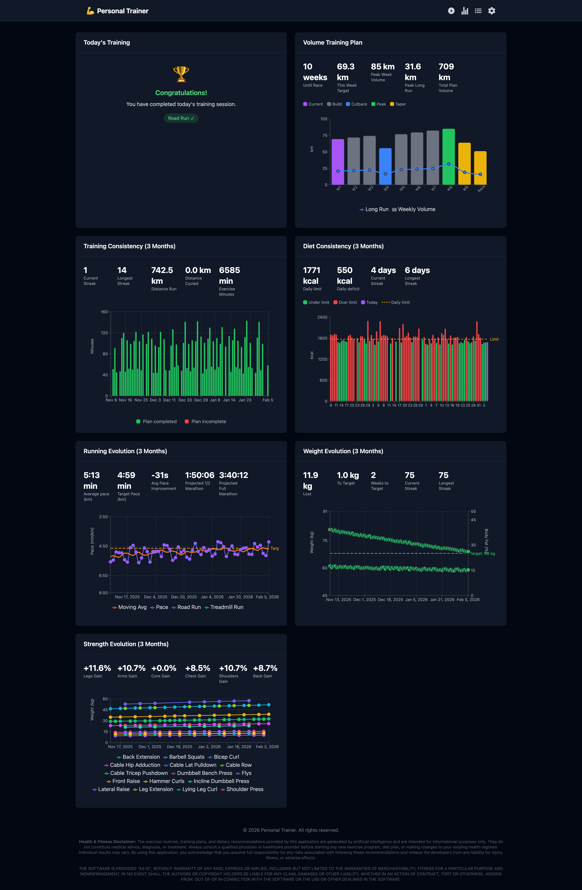

# Personal Trainer (PT)

A personal fitness tracking PWA for monitoring running pace, strength training, weight, and diet.

**Demo mode**: https://www.remojansen.com/pt?demo=true

**Registration**: https://www.remojansen.com/pt

## Privacy & Data Storage

This application prioritizes user privacy:

- **No external databases** - Your personal data is never sent to or stored on external servers
- **No tracking cookies** - No analytics, no tracking, no cookies
- **Local-first storage** - All data is stored in your browser's IndexedDB
- **No user accounts** - One profile per device, no sign-up required
- **User-controlled backups** - For data backup and sync across devices, use the cloud folder feature (File System Access API) to save data to a folder of your choice (e.g., iCloud, Dropbox, Google Drive)

## Features

- **Training Schedule**: Configure weekly workout plans with cardio and strength activities
- **Activity Tracking**: Log runs, swims, cycling, and strength training sessions
- **Progress Charts**: Visualize running pace evolution, weight trends, and strength gains
- **Training Consistency**: Track workout adherence and training volume
- **Volume Planning**: Plan training volume for race preparation
- **Diet Tracking**: Monitor daily calorie intake
- **Guided Tour**: Interactive onboarding for new users
- **Offline-First**: All data stored locally in IndexedDB
- **Optional Backup**: Sync data via File System Access API to a local folder
- **Installable PWA**: Install as a native-like app on any device

<br/>



## Tech Stack

- React 18 + TypeScript + Vite
- Tailwind CSS (dark theme)
- IndexedDB via `idb` library
- PWA with `vite-plugin-pwa` + Workbox
- react-router-dom for routing
- recharts for data visualization
- react-joyride for guided tours
- Biome for linting and formatting

## Getting Started

```bash
npm install
npm run dev
```

## Available Scripts

```bash
npm run dev      # Start dev server
npm run build    # TypeScript check + Vite build
npm run check    # Biome lint + format check
npm run format   # Auto-fix lint/format issues
npm run lint     # Run Biome linter only
npm run preview  # Preview production build
```

## Notice

**This is a personal project**, highly customized to my specific training needs and preferences. Pull requests are not accepted.

If you find this useful, please **fork the repository** and adapt it to your own requirements. You're welcome to use this as a starting point for your own fitness tracker.

## License

MIT
